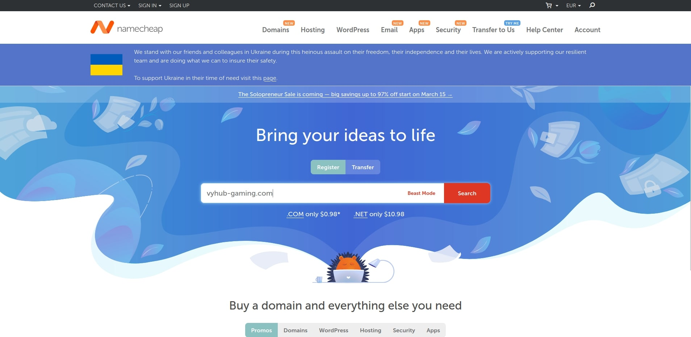
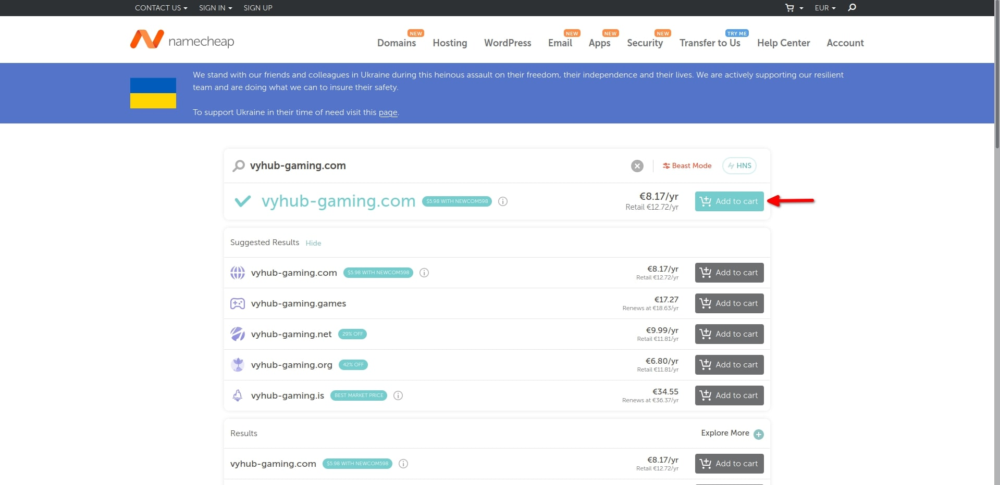
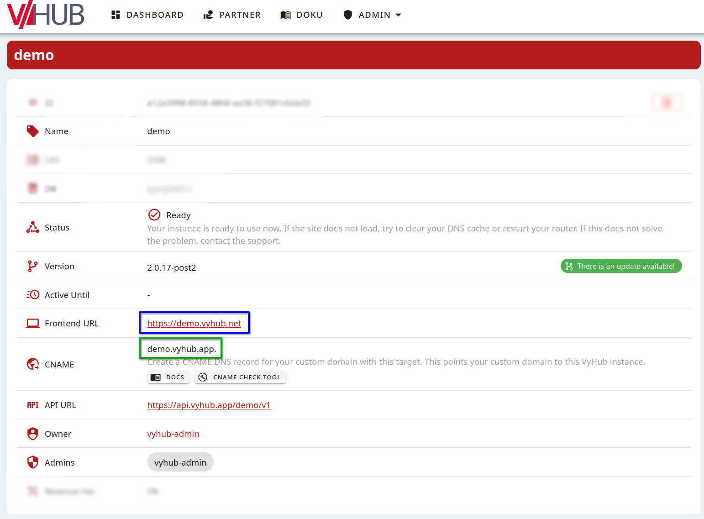

# Custom Domain

Read this guide for further information on how to use your own domain with VyHub.  
You do not need to use your own domain, we offer you a free vyhub.app domain (e.g. gaming.vyhub.app)

1. Buy your own domain at a domain name registrar of your choice (e.g. <a href="https://namecheap.pxf.io/MXzdRY" rel="nofollow">Namecheap*</a>)
2. Set the domains CNAME record to the corresponding VyHub url

## Set-up service

You want to personalize your VyHub website with a custom domain? But you do not have a domain, or you do not want to go through the technical hassle?

We have got you covered with our custom domain set-up service. We will buy and manage all the upcoming hassle for you for just (**15€** + the cost of your domain) per year.

> Send us a simple message including your desired domain and the keyword domain-set up service to <a href="mailto:support@vyhub.net">support@vyhub.net</a>.

You can find your favorite domain using the [Namecheap domain finder](https://namecheap.pxf.io/MXzdRY). 

## Buy your own domain using Namecheap

> A domain name is the name of a website (like vyhub.net or google.com)

In this guide we will use <a href="https://namecheap.pxf.io/MXzdRY" rel="nofollow">Namecheap*</a>, which offers good prices and is one of the biggest registrars in the world.

### Choose your desired domain name, add to cart and checkout

Enter a domain name and check for it's availability

Add to cart and follow the checkout process

> You do not need to add any of the "recommended packages" namecheap offers.

## Set the domains CNAME record

> You need to set the CNAME record to our servers, that you can reach VyHub with your domain.

Please search and follow the tutorials on how to set the CNAME record provided by your registrar.

### CNAME Value

Find the value on the instance details page

### Setting the CNAME with a Namecheap.com domain
Follow this <a href="https://namecheap.pxf.io/x9a6z3" rel="nofollow">guide*</a> provided by namecheap. 

1. Sign in to your Namecheap account
2. Select `Domain list` on the left
3. Click the `Manage` button next to your domain
4. Navigate to the `Advanced DNS` tab
5. Click `Add New Record` in the `Host Records` section
6. Select `CNAME Record`
7. Enter the CNAME value from your instance in the `Value` column 
8. Enter Host value
   - Root Domain (e.g. your-community.de) | Value: `@`
   - Subdomain (e.g. shop.your-community.de) | Value: `shop`
9. Click the `Save All Changes` button

## Debugging with the CNAME checker

You set your CNAME, but the instance is still not loading?
Please check whether the values shown on your instance page match up with the values in the [CNAME-checker](https://mxtoolbox.com/SuperTool.aspx?action=cname)

1. Use the CNAME-checker linked in the instance details of your VyHub instance
2. Check whether the values match up (next two screenshots)

The values match and it is still not loading? Contact us!

## Further help?

Watch our [Youtube video](https://www.youtube.com/watch?v=RQYqynCzfyI), use our [setup-service](#set-up-service) or contact us.

Disclaimer: This post contains affiliate links, and we may earn a small commission when you click on the links at no additional cost to you.

