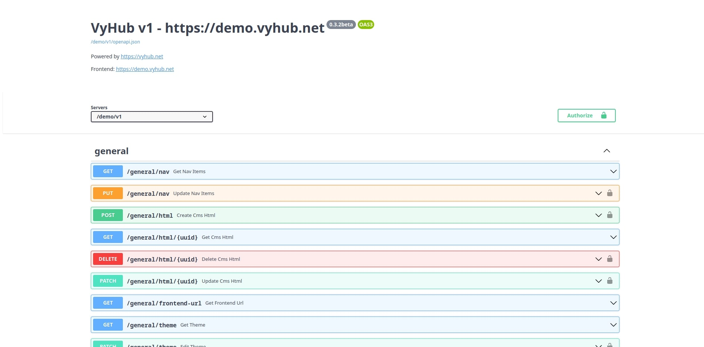
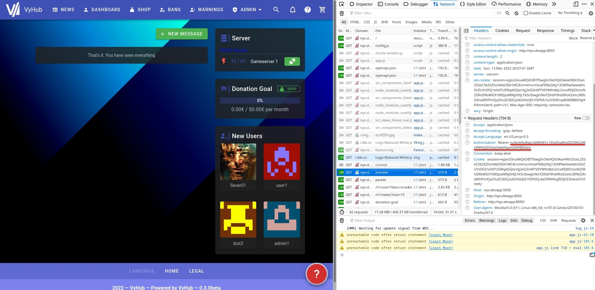

# API

Your VyHub instance comes with a fully fetched REST API. You can use the API to create custom integrations or to
automate tasks (like invoice download for your bookkeeping).

The API is accessible under `https://api.vyhub.app/{instance_name}/v1`

## Documentation and Swagger UI

You can view the documentation and interact with the api through the Swagger UI which is accessible under
`https://api.vyhub.app/{instance_name}/v1/docs`

### Authorization

Some endpoints need authorization. You can set your authorization key at the top right of the documentation.

For testing purposes, you can use the authorization key you get, after you logged into your instance. Open the developer
options in your browser and inspect the headers of a request in the network tab.

## Creating API keys

New API keys with custom permissions can be created in the settings under the `API` keys tab. Press `Create Key`
and fill in the following fields:

| Attribute             | Description                                                                            |
|-----------------------|----------------------------------------------------------------------------------------|
| Name                  | A name to identify the key.                                                             |
| Properties            | The permissions (scopes) granted to the key. At least one property is required.        |
| Limit to Serverbundle | [Optional] Restrict the key to a single serverbundle.                                  |

After creation, the full key is shown once at the top of the page. Copy it immediately, as it cannot be retrieved
again later. Existing keys are listed in the table with their name, hidden key, granted properties and serverbundle,
and can be revoked using the revoke button.
